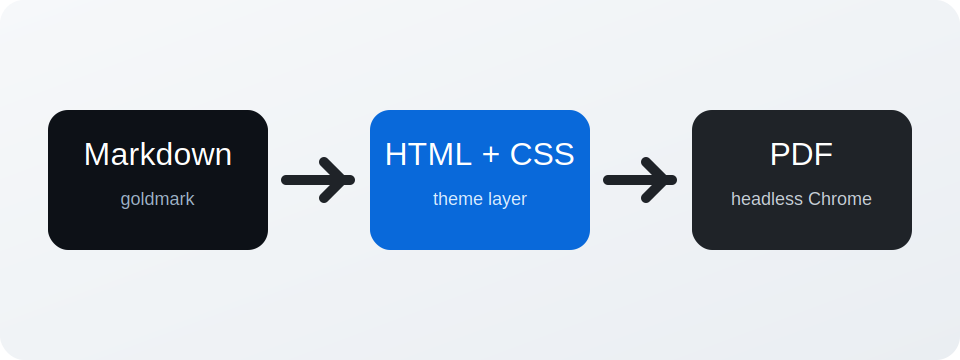

# Markdown Rendering Fixture

This document exercises the Markdown and print features that `md2pdf` is expected to support. It is intentionally dense so visual regressions show up quickly.

## Typography

Plain text should sit comfortably on the page. We want **bold**, *italic*, ***bold italic***, ~~strikethrough~~, `inline code`, and [links](https://example.com) to all read clearly.

Automatic linking should also work for https://golang.org and definition lists should stay readable.

Term One
: The first definition should align properly and preserve spacing.

Term Two
: A second definition helps catch margin and line-height issues.

## Lists

- Unordered item one
- Unordered item two
  - Nested items are represented in raw Markdown, even if styling is intentionally simple
- Unordered item three

1. Ordered item one
2. Ordered item two
3. Ordered item three

- [x] Completed task
- [ ] Incomplete task

## Blockquote

> A blockquote should be visually distinct without overwhelming the content.
>
> It should also allow multiple paragraphs and comfortable reading width.

## Table

| Column | Meaning | Notes |
| --- | --- | --- |
| Alpha | Short text | Default alignment |
| Beta | Longer text to test wrapping inside cells | The PDF should avoid ugly overflow |
| Gamma | `code` inside a table | Borders should remain crisp |

## Code

```go
package main

import "fmt"

func main() {
    values := []string{"markdown", "html", "pdf"}
    for _, value := range values {
        fmt.Printf("render %s\n", value)
    }
}
```

```json
{
  "name": "md2pdf",
  "mode": "headless-browser",
  "inspiredBy": "vscode-markdown-pdf"
}
```

## Horizontal Rule

---

## Local Image

The image below is loaded from a relative path and should render inside the PDF:



## Inline HTML

<div class="callout">
  <strong>Inline HTML should render</strong> when it is useful for structured content.
</div>

## Footnotes

Footnotes should appear near the end of the document with readable separators.[^footnote]

[^footnote]: This is a footnote used to validate endnotes and spacing.

## Final Paragraph

Pagination matters. This fixture is intended to be long enough to exercise headings, wrapped paragraphs, tables, code fences, lists, quotes, and image rendering in a single output file.

